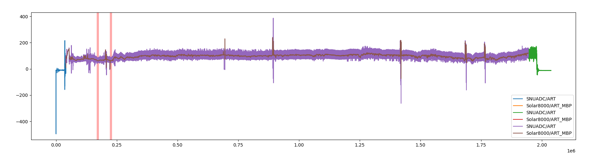

<p align="center">


</p>

# Intra Operative Hypotension prediction
> Internship project at [VERIMAG](https://www.verimag.fr/)

The goal of this project is to train a machine learning model to predict IOH events before they occur.

<details>
<summary>Table of contents</summary>
<ol>
<li><a href="#intra-operative-hypotension-prediction">Introduction</a></li>
<li><a href="#roadmap">Roadmap</a></li>
<li><a href="#data-used">Data used</a></li>
<li><a href="#usage">Usage</a></li>
</ol>
</details>

## Roadmap

- [x] Selecting, downloading and cleaning up data
- [ ] [IN PROGRESS] Preprocessing the data 
- [ ] Training the model
- [ ] Evaluating the model

## Data used

Our training data come from the [VitalDB](https://vitaldb.net/) open dataset.
The python script used to process the data is in [create_database.py](create_database.py).

## Usage

### Downloading and preprocessing the data

> Note that download and preprocessing of the data are multithreaded.

You should first set up the environment by removing the `.dist` extension from [env.json.dist](env.json.dist) and change its settings as you see fit.
```bash
python create_database.py -dl
```
You can then preprocess the data :
```bash
python create_database.py -pre
```
These two options can be combined in one command :
```bash
python create_database.py -dl -pre
```

### Visualizing the preprocessed data

You can visualize the data with the following command :
```bash
python plotting.py
```
The resulting matplotlib figure will look like this :

This view combines both the raw and preprocessed data.
Blue and green zones are deleted from the raw data (preanesthesia and postanesthesia).
Arterial pressure is drawn in purple and overlayed with mean arterial pressure.
IOH events are marked with a red vertical line.
