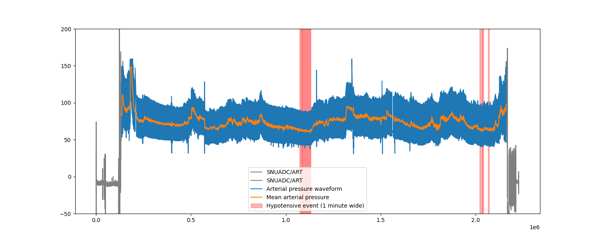

<p align="center">


</p>

# Intra Operative Hypotension prediction
> Internship project at [VERIMAG](https://www.verimag.fr/)

The goal of this project is to train a machine learning model to predict IOH events before they occur.

<details>
<summary>Table of contents</summary>
<ol>
<li><a href="#intra-operative-hypotension-prediction">Introduction</a></li>
<li><a href="#roadmap">Roadmap</a></li>
<li><a href="#data-used">Data used</a></li>
<li><a href="#usage">Usage</a></li>
</ol>
</details>

## Roadmap

- [x] Selecting, downloading and cleaning up data
- [x] Preprocessing the data 
- [x] Training the model
- [x] Evaluating the model

## Data used

Our training data come from the [VitalDB](https://vitaldb.net/) open dataset.
The python script used to process the data is in [create_dataset.py](create_dataset.py).

## Usage

### Downloading and preprocessing the data

> Note that most functions are multithreaded.

```
usage: main.py [-h] [-d] [-c] [-f] [-r] [-p] [-l] [-t] [-e EPOCHS] [-T] [-n -1..6388]

options:
  -h, --help            show this help message and exit
  -d, --download        download [-n] cases from VitalDB that have all tracks listed in env.json.
  -c, --clean           clean [-n] downloaded cases and pickle them to {env.DATA_FOLDER}preprocessed/
  -f, --force           don't skip already preprocessed data, process it again
  -r, --reshape         reshape [-n] cases from the preprocessed data into the format required by Rocket and Sklearn
                        (windows of env.WINDOW_SIZE seconds)and pickle them to {env.DATA_FOLDER}ready/
  -p, --preprocess      preprocess (clean + reshape) [-n] cases from D:\come\datavital and pickle them to
                        D:\come\dataready/cases/
  -l, --label           create label dataframes shifted by env.PRED_WINDOW minutes to train the model and pickle them
                        to D:\come\dataready/labels/
  -t, --train_sgd       train the SGD model on [-n] cases from D:\come\dataready/test
  -e EPOCHS, --epochs EPOCHS
                        number of epochs to train the model
  -T, --test_sgd        test the model on [-n] cases from {env.DATA_FOLDER}test/
  -n -1..6388, --max-number -1..6388
                        max number of cases to apply the chosen functions to, -1 for all cases, defaults to 10
```

### Visualizing the preprocessed data

You can visualize the data by running the following program :
```bash
python plotting.py
```
The resulting matplotlib figure will look like this :

This view combines both the raw and preprocessed data.
Gray zones are before and after anesthesia, so they are cropped in the processing.
Arterial pressure is drawn in blue and overlayed with mean arterial pressure in orange.
IOH events are marked with a red vertical line 1 minute wide.

You can also find an interactive version of this figure in this [Google Colab notebook](https://colab.research.google.com/drive/12LOvNX076Kx2t6ikOKpBpGCG7m3t8fZH).
